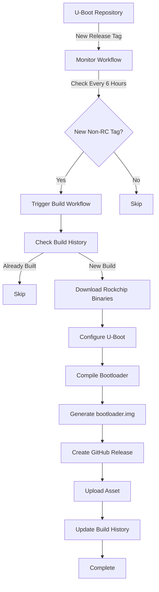

# Turing RK1 Bootloader - CI/CD Workflow Setup Guide

## Overview

This guide documents the complete CI/CD workflow setup for automatically building Turing RK1 bootloader images from U-Boot releases.

**Key Features:**

- ✅ Automatic detection of new U-Boot releases (non-RC versions)
- ✅ Reproducible builds using GCC 15.2.0 container
- ✅ Automatic GitHub releases with bootloader.img artifacts
- ✅ Build history tracking (prevents duplicate builds)
- ✅ Manual workflow trigger support
- ✅ Local development environment matches CI environment

---

## Architecture



## Workflow Files

### 1. Monitor U-Boot Releases

**File:** `.github/workflows/monitor-uboot-releases.yml`

**Purpose:** Periodically checks U-Boot repository for new releases and triggers the build workflow.

**Trigger:** Every 6 hours via cron schedule

**What it does:**

Fetches all tags from `https://github.com/u-boot/u-boot`
Filters out RC (release candidate) versions
Compares against `.builds-completed` file
Triggers build workflow if new tag found 2. Build on U-Boot Release

### 2. Build on U-Boot Release

**File:** `.github/workflows/build-on-uboot-release.yml`

**Purpose:** Main build workflow that compiles the bootloader.

**Triggers:**

- Manual trigger via GitHub UI (workflow_dispatch)
- Automatic trigger from monitor workflow
- Optional tag input parameter

**Jobs:**

1. `check-latest-uboot` - Determines which U-Boot tag to build
2. `build-bootloader` - Builds the bootloader and creates release

## Workflow Triggers

### Automatic Detection (Every 6 Hours)

Monitor workflow automatically checks for new U-Boot releases every 6 hours and triggers build if needed.

### Manual Trigger

Go to your repository:

1. Actions tab
2. Select Build on U-Boot Release
3. Click Run workflow
4. (Optional) Enter specific U-Boot tag (e.g., `v2024.07`)
5. Click Run workflow

### Via GitHub CLI

```bash
# Trigger with latest tag detection

gh workflow run build-on-uboot-release.yml -r main

# Trigger with specific tag

gh workflow run build-on-uboot-release.yml -r main -f uboot_tag=v2024.07
```

## Build Environment

### Container Image

**Base:** `gcc:15.2.0`
**Environment:** Ubuntu 20.04 with build tools
**Dependencies:**

- bison
- curl
- make
- flex
- python3-pyelftools
- python3-setuptools
- python3-dev
- swig

### Build Steps

1. Checkout code and u-boot submodule
2. Fetch specified U-Boot tag
3. Download Rockchip binaries
4. Configure for Turing RK1 (turing-rk1-rk3588_defconfig)
5. Compile U-Boot
6. Generate bootloader image using `dd`
7. Create GitHub release with artifact

## Build History Tracking

The workflow maintains a `.builds-completed` file to prevent duplicate builds.

**File Format:**

```Code
v2024.01
v2024.04
v2024.07
```

Each line contains a built U-Boot version tag.

**How it works:**

1. Before building, workflow checks if tag exists in `.builds-completed`
2. If found, build is skipped
3. After successful build, tag is appended to file
4. File is committed and pushed to repository

## GitHub Releases

Upon successful build, a GitHub release is created automatically.

### Release Structure

- **Tag:** `bootloader-vX.Y.Z` (e.g., `bootloader-v2024.07`)
- **Name:** `Bootloader for U-Boot vX.Y.Z`
- **Asset:** `bootloader-vX.Y.Z.img`
-

### Release Notes Include

- U-Boot version
- Build date
- Target hardware (Turing Pi RK1, RK3588)
- Configuration used
- Usage instructions
- Build environment details

### Download Options

1. GitHub UI: Releases → Select release → Download asset
2. Direct Link:

```Code
https://github.com/danste22/turing-rk1-bootloader/releases/download/bootloader-vX.Y.Z/bootloader-vX.Y.Z.img
```

3. GitHub CLI:
   ```bash
   gh release download bootloader-v2024.07 -p "\*.img"
   ```

## Local Development Setup

### Prerequisites

- Docker installed
- Git with submodule support
- ~2GB free disk space

### Setup Steps

1. Clone Repository

   ```bash
   git clone https://github.com/danste22/turing-rk1-bootloader.git
   cd turing-rk1-bootloader
   ```

2. Initialize U-Boot Submodule

   ```bash
   git submodule update --init --recursive
   ```

3. Build Docker Image

   ```bash
   docker build -f .devcontainer/Dockerfile -t bootloader:dev .
   ```

4. Test Build Locally

   ```bash
   cd u-boot
   git fetch origin tag v2024.07
   git checkout v2024.07
   cd ..

   docker run --rm \
     -v $(pwd):/workspace \
     -w /workspace/u-boot \
     bootloader:dev \
   bash -c "
     mkdir -p rkbin && \
     curl -fsSL -o rkbin/rk3588_bl31_v1.51.elf \
       https://github.com/rockchip-linux/rkbin/raw/refs/heads/master/bin/rk35/rk3588_bl31_v1.51.elf && \
     curl -fsSL -o rkbin/rk3588_ddr_lp4_2112MHz_lp5_2400MHz_v1.19.bin \
       https://github.com/rockchip-linux/rkbin/raw/refs/heads/master/bin/rk35/rk3588_ddr_lp4_2112MHz_lp5_2400MHz_v1.19.bin && \
     make turing-rk1-rk3588_defconfig && \
     ROCKCHIP_TPL=rkbin/rk3588_ddr_lp4_2112MHz_lp5_2400MHz_v1.19.bin \
     BL31=rkbin/rk3588_bl31_v1.51.elf \
     make -j\$(nproc) && \
     dd if=/dev/zero of=bootloader.img bs=512 count=32767 && \
     dd if=./idbloader.img of=bootloader.img bs=512 seek=64 conv=notrunc && \
     dd if=./u-boot.itb of=bootloader.img bs=512 seek=16384 && \
     echo 'Build successful!' && \
     ls -lah bootloader.img
     "
   ```

### Using VSCode Dev Containers

1. Install Dev Containers Extension
2. Open project in VSCode
3. Click green icon (bottom left) → "Reopen in Container"
4. VSCode will build and open the development container

## Reproducibility

### Local ↔ CI Consistency

Both local development and CI use the **same base image**:

- `gcc:15.2.0`
- Same dependency versions
- Same build configuration

This ensures:

- ✅ Builds work identically locally and in CI
- ✅ No "works on my machine" issues
- ✅ Reproducible bootloader images
- ✅ Easy debugging of build issues

## Build Reproduction

```bash
# Local build exactly matches CI
docker run --rm \
  -v $(pwd):/workspace \
  -w /workspace/u-boot \
  gcc:15.2.0 \
bash -c "
apt-get update && \
apt-get install -y bison curl make flex python3-pyelftools python3-setuptools python3-dev swig && \
# ... rest of build commands
"
```

## Troubleshooting

### Build Fails in CI but Works Locally

1. Check CI logs for exact error
2. Verify Docker image version matches (gcc:15.2.0)
3. Ensure submodule is initialized: `git submodule update --init --recursive`
4. Check U-Boot tag is valid

### Rockchip Binaries Download Fails

- Verify internet connectivity
- Check GitHub rate limiting
- Try manual download and add to repository

### Build Already Marked as Complete but Needs Rebuild

```bash
# Edit .builds-completed to remove unwanted tag
git checkout .builds-completed # Revert to last commit
# Or manually edit and remove the tag line
git add .builds-completed
git commit -m "Remove tag from build history"
git push
```

### Monitor Workflow Not Triggering Build

1. Verify monitor workflow runs successfully (check Actions tab)
2. Check `.builds-completed` doesn't contain the tag
3. Verify build workflow file syntax is valid
4. Try manual trigger as test

## Configuration

### Changing Monitor Schedule

Edit `.github/workflows/monitor-uboot-releases.yml`:

```YAML
on:
schedule: - cron: '0 _/6 _ \* \*' # Change from every 6 hours
```

Common cron patterns:

- '0 0 \* \* \_' - Daily at 00:00 UTC
- '0 _/4 \* \* _' - Every 4 hours
- '0 0 \_ \* 0' - Weekly on Sunday at 00:00 UTC

### Changing Build Configuration

Edit `.devcontainer/Dockerfile` to add/remove packages:

```Dockerfile
RUN apt-get update && \
apt-get install -y \
# Add new packages here
&& apt-get clean && rm -rf /var/lib/apt/lists/\*
```

### Changing U-Boot Configuration

Edit build step in `.github/workflows/build-on-uboot-release.yml`:

```bash
make your-custom-defconfig # Instead of turing-rk1-rk3588_defconfig
```

## File Structure

```Code
turing-rk1-bootloader/
├── .github/
│ └── workflows/
│ ├── monitor-uboot-releases.yml # Monitor for new releases
│ └── build-on-uboot-release.yml # Main build workflow
├── .devcontainer/
│ ├── Dockerfile # Build container definition
│ └── devcontainer.json # VSCode dev container config
├── .gitmodules # Git submodule configuration
├── .builds-completed # Build history (auto-generated)
├── u-boot/ # U-Boot source (submodule)
├── README.md # Project documentation
└── WORKFLOW_SETUP.md # This file
```

## Security Considerations

### GITHUB_TOKEN Permissions

The workflows use `GITHUB_TOKEN` with:

- `contents: read/write` - For git operations
- `actions: read` - For workflow dispatch

These are automatically provided by GitHub Actions with minimal required permissions.

### Build Artifacts

- Artifacts retained for 30 days by default
- Releases are permanent unless manually deleted
- All build logs are public

## Performance Optimization

### Docker Layer Caching

The monitor workflow could be optimized with Docker registry caching:

```YAML

- name: Set up Docker Buildx
  uses: docker/setup-buildx-action@v3

- name: Build Docker image
  uses: docker/build-push-action@v5
  with:
  context: .
  file: .devcontainer/Dockerfile
  tags: bootloader:latest
  cache-from: type=gha
  cache-to: type=gha,mode=max
  load: true
```

### Build Parallelization

Build uses `make -j$(nproc)` to utilize all CPU cores automatically.

## Future Enhancements

Possible improvements:

- [ ] Automatic release notes generation from commits
- [ ] Build time tracking and reporting
- [ ] Binary signing with GPG
- [ ] Automated testing of bootloader image
- [ ] Distribution to external repositories
- [ ] Build notifications (Slack, email)
- [ ] Performance benchmarking
- [ ] Support for multiple board targets

## Support & Issues

For issues with:

- **Workflow logic** - Check GitHub Actions logs
- **Build failures** - Review CI logs and compare with local build
- **U-Boot version** - Check U-Boot releases
- **Container issues** - Verify Docker installation and GCC image availability

## References

- [U-Boot Repository](https://github.com/u-boot/u-boot)
- [Rockchip Linux Binaries](https://github.com/rockchip-linux/rkbin)
- [GitHub Actions Documentation](https://docs.github.com/en/actions)
- [Dev Containers Specification](https://containers.dev/)
- [Turing Pi Documentation](https://docs.turingpi.com/)
